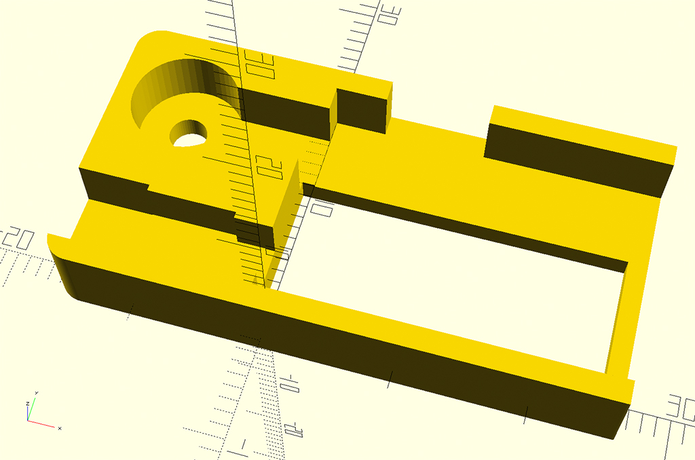

Электронная шпаргалка от AlexGyver
=====================

Это электронная шпаргалка, позволяющая незаметно списать тест. Авторский проект [AlexGyver](https://alexgyver.ru/gyvercheat/) разведенный на одной маленькой плате. Так же используется небольшой LiPo аккумулятор с возможностью зарядки. В остальном по функциональности ничем не отличается от версии на Arduino Nano.

|   Сторона 1           | Сторона 2
|-----------------------|-----------------------
|  | 

Особенности:

*	Хранение ответов в EEPROM памяти микроконтроллера (до 1020 цифр);
*	Управление одной кнопкой;
*	Вывод ответов количеством вибраций;
*   Добавление билетов по UART;

## Инструкция по эксплуатации

Подключаем по UART к компьютеру и заносить билеты с ответами на них. Как это делается подробно рассказывает автор в своем [видео](https://www.youtube.com/watch?v=9YlfDXCbW8]).

Накликиваем нужный билет/вариант – получаем подтверждение в виде количества импульсов вибрации.

**Долгий клик** – выбор билета/варианта, подтверждение – одиночный короткий импульс вибрации. Пока билет не выбран долгим кликом, можно накликать другой номер!

**Клик** – вывод вибрацией ответа на следующий вопрос.

**Долгий клик** – возврат в меню, подтверждение – долгая вибрация. Долгая вибрация также будет при ошибках (нет такого билета, закончились вопросы в выбранном билете).

## Распиновка разъема

5-и контактный разъем JST-SH 1.0 мм. служит для подключение к USB через USB-UART конвертер а также зарядки аккумулятора. О зарядке информирует светодиод. Когда он погаснет - зарядка окончена.

|  USB-UART конвертер   | Разъем платы
|-----------------------|-------------------------
|1. DTR -|1. 5V - Красный провод
|2. RX - Желтый провод|2. GND - Черный провод
|3. TX - Белый провод|3. -
|4. 5V - Красный провод (нужен для зарядки аккумулятора)|4. RX - Белый провод
|5. CTS -|5. TX - Желтый провод
|6. GND - Черный провод (нужен для зарядки аккумулятора)|

## Схемы

Оригинальная схема автора. Используется Arduino Nano и плата контроллера заряда аккумулятора TP4056.

В схему добавлено:

|MCP73831T-2ACI/OT Контроллер заряда батарей Li-Ion/Li-Pol 15mA to 500mA 4.2V [SOT-23-5]| MCP1703T-3302E/CB Регулятор напряжения линейный, 200MA 3.3V [SOT-23A]
|-----------------------|-------------------------
|  | 

## Плата

Делалась как можно компактнее, но пригодная к повторению.

|   Верх                | Низ
|-----------------------|-------------------------
|  | 

#### BOM:

|No|Name|Value|Layer|Comment
|---|---|---|---|---
|1|C1,C2|10u|Top,Bottom|Tantal
|2|C3,C4,C5,C6,C7|0.1u|Top,Bottom|0805
|3|D1,D2|BAT20|Bottom|SOD-323
|4|D3||Bottom|LED
|5|J1|SM05B-SRSS-TB|Top|
|6|J2|MK12C02|Bottom|
|7|Q1|8Mhz|Top|
|8|Q2|IRFML8244|Top|SOT-23A
|9|R1,R2,R3|10k|Top,Bottom|0805
|10|R4,R5|100R|Top,Bottom|0805
|11|U1|Atmega328|Top|TQFP-32
|12|U2|MCP73831T|Bottom|SOT-23-5
|13|U3|MCP1703T|Bottom|SOT-23A

## Корпус

Корпус распечатан на 3D принтере. Предназначен для удобной сборки в один небольшой корпус. Используется разъем JST PH 2.0 мм. 2-Pin для выноса кнопки на провод.

|   Корпус            | Сборка
|---------------------|---------------------------
|  | 

## Прошивка

* Любым программатором загружается bootloader (HEX файл и фьюзы прилагаются). Самой простой вариант прошить через USB Arduino NANO и "сдуть" с нее чип.
* Впаивается чип на плату.
* Заливается INO файл из Arduino IDE (как Arduino NANO) с помощью USB-UART преобразователя (FTDI).

## Контакты

GitHub автора: [https://github.com/AlexGyver/GyverCheat](https://github.com/AlexGyver/GyverCheat)

Связаться со мной: info@dementiev.net

##### Лицензия: «Attribution-NonCommercial-ShareAlike» («Атрибуция — Некоммерческое использование — На тех же условиях») 4.0 Всемирная

